<div align="center">




<br>


</div>

---

<div align="center">

### `// BOOT.SEQUENCE`

</div>

```text
                        ╔══════════════════════════════════════════════════════════════╗
                        ║  ▓▓▓▓  O D I N . O S   v2.0   —   (c) 1985–∞  ▓▓▓▓          ║
                        ╠══════════════════════════════════════════════════════════════╣
                        ║  [ OK ]  Mounting /dev/curiosity ......................... ✔ ║
                        ║  [ OK ]  Loading C, C++, Java, Kotlin, Python, JS, TS .... ✔ ║
                        ║  [ OK ]  Linking cloud: AWS • Azure • GCP ................ ✔ ║
                        ║  [ OK ]  Spawning side-projects (pid 1337) ............... ✔ ║
                        ║  [WARN]  Sleep.sys not found ............................. ⚠ ║
                        ║  [ OK ]  System ready. Awaiting input_                       ║
                        ╚══════════════════════════════════════════════════════════════╝
```

<div align="center">

<sub>I enjoy turning ideas into software — from low-level code to modern web apps, cloud infrastructure, and everything in between.</sub>

</div>

---

<div align="center">

### `// SYSTEM.IDENTITY`

</div>

```text
                        ┌──────────────────────────────────────────────────────┐
                        │  odin@github:~$ neofetch
                        
                                    ██████╗ ██████╗ ██╗███╗   ██╗
                                   ██╔═══██╗██╔══██╗██║████╗  ██║
                                   ██║   ██║██║  ██║██║██╔██╗ ██║                                                   
                                   ██║   ██║██║  ██║██║██║╚██╗██║
                                   ██║   ██║██║  ██║██║██║╚██╗██║
                                   ╚██████╔╝██████╔╝██║██║ ╚████║                                                      
                                    ╚═════╝ ╚═════╝ ╚═╝╚═╝  ╚═══╝
                         OS              GitHub
                         HOST            Odin's Workspace
                         KERNEL          Curiosity
                         SHELL           zsh / powershell
                         EDITOR          VS Code
                         STATUS          ONLINE
                        
                        └──────────────────────────────────────────────────────┘
```

<div align="center">

🟢 `ONLINE` &nbsp;•&nbsp; 🔵 `BUILDING` &nbsp;•&nbsp; 🟣 `LEARNING`

</div>

---

<div align="center">

### `// TECH.ARSENAL`

**LANGUAGES**<br>


**WEB & APPLICATION**<br>


**CLOUD • DEVOPS • INFRASTRUCTURE**<br>


**DATABASES**<br>


**TOOLS**<br>


</div>

---

<div align="center">

### `// CURRENT.MISSION`

</div>

```text
                        ┌─────────────────────────────────────────────────────────────┐
                        │                                                             │
                        │     [01] BUILD        ████████████████████░░░░   ACTIVE     │
                        │     [02] LEARN        █████████████████░░░░░░░   ACTIVE     │
                        │     [03] EXPLORE      ███████████████░░░░░░░░░   ACTIVE     │
                        │     [04] EXPERIMENT   ███████████████████░░░░░   ACTIVE     │
                        │                                                             │
                        └─────────────────────────────────────────────────────────────┘
```

<div align="center">

**Currently exploring new technologies, architectures, tools and ideas.**

`if (looks_interesting) { build_something_with_it(); }`

</div>

---

<div align="center">

### `// GITHUB.ANALYTICS`


&nbsp;


</div>

---

<div align="center">

### `// ACHIEVEMENTS`

```text
 ╔══════════════════════════════════════════╗
 ║  ★  ACHIEVEMENTS  UNLOCKED  :  6 / 8  ★  ║
 ╚══════════════════════════════════════════╝
```


<br><br>

<!-- Live trophies: these load from a free third-party service and show up once your account has activity. If the service is down they just appear blank — the badges above always work. -->


<br>

### `// CONTRIBUTION.MATRIX`


<br>


</div>

---

<div align="center">

### `// SYSTEM.STATUS`

```text
  MOTIVATION  ████████████████████████████████████████  100%
  COFFEE      ██████████████████████████████░░░░░░░░░░   75%
  SLEEP       ██████░░░░░░░░░░░░░░░░░░░░░░░░░░░░░░░░░░   15%
```

### `// CONNECT`

<a href="https://github.com/Odin-Gojo"></a>
&nbsp;
<a href="https://codepen.io/Odin"></a>

<br>

```text
  ╔════════════════════════════════════════════╗
  ║   INSERT COIN TO CONTINUE...   [ 1 UP ]    ║
  ║   [ SYSTEM ONLINE ]  [ ALL SYSTEMS NOMINAL ]║
  ╚════════════════════════════════════════════╝
```


</div>
